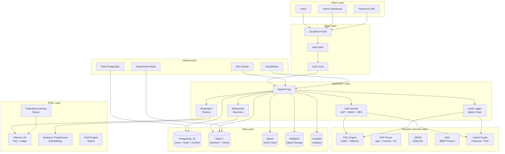
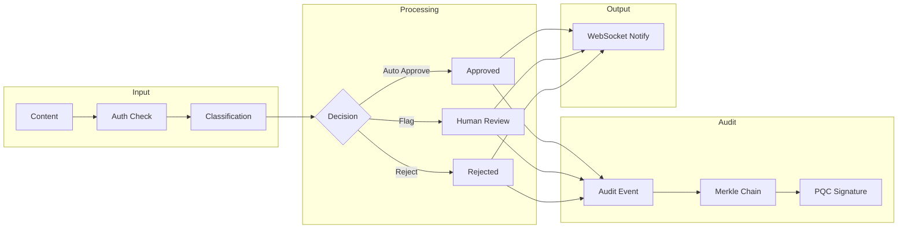
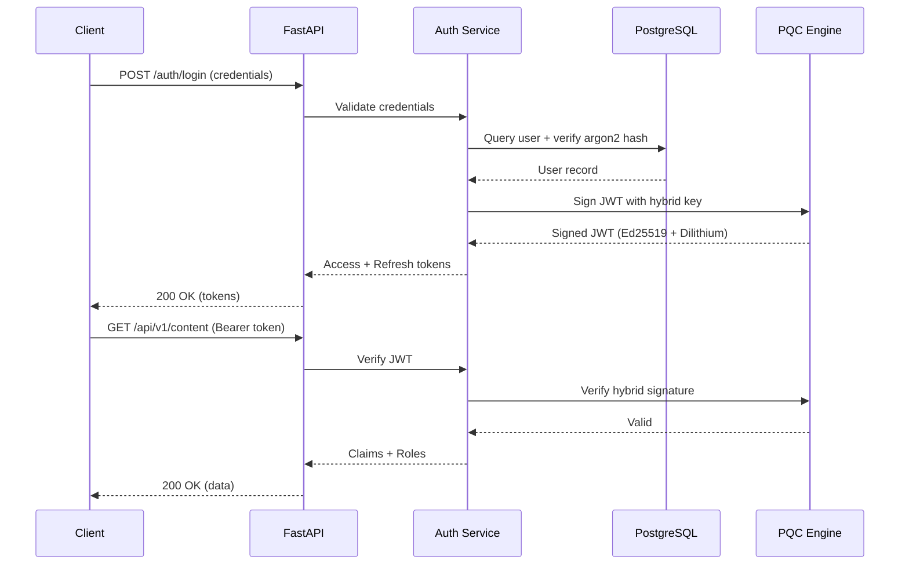
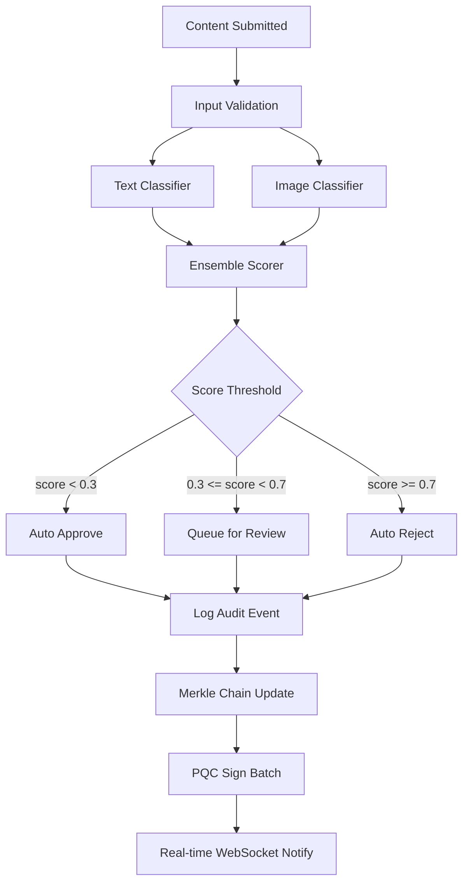
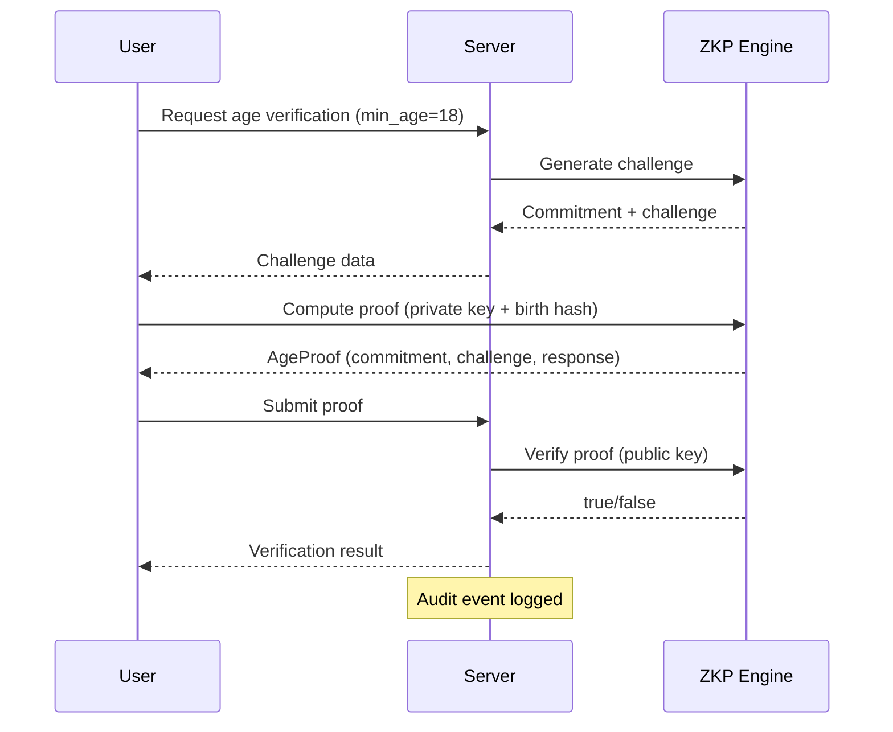

# System Architecture Diagram

## High-Level Architecture

```mermaid
graph TB
    subgraph "Client Layer"
        U[Users]
        A[Admin Dashboard]
        SDK[Python/JS SDK]
    end

    subgraph "Edge Layer"
        CF[CloudFront CDN]
        WAF[AWS WAF]
        NLB[NLB / ALB]
    end

    subgraph "Application Layer"
        API[FastAPI App]
        Auth[Auth Service<br/>JWT + RBAC + MFA]
        Mod[Moderation<br/>Pipeline]
        Audit[Audit Logger<br/>Merkle Chain]
        RT[WebSocket<br/>Real-time]
    end

    subgraph "Quantum Security Layer"
        PQC[PQC Engine<br/>Kyber + Dilithium]
        ZKP[ZKP Prover<br/>Age + Consent + ID]
        QRNG[QRNG<br/>Qiskit Aer]
        QKD[QKD<br/>BB84 Protocol]
        Hybrid[Hybrid Crypto<br/>Classical + PQC]
    end

    subgraph "AI/ML Layer"
        Ollama[Ollama LLM<br/>Text + Image]
        ST[Sentence Transformers<br/>Embeddings]
        FL[Federated Learning<br/>Flower]
        RAG[RAG Engine<br/>Qdrant]
    end

    subgraph "Data Layer"
        PG[(PostgreSQL 16<br/>Users + Audit + Content)]
        RD[(Redis 7<br/>Sessions + Cache)]
        QD[(Qdrant<br/>Vector Store)]
        S3[(S3/MinIO<br/>Object Storage)]
        DDB[(DuckDB<br/>Analytics)]
    end

    subgraph "Infrastructure"
        EKS[EKS Cluster]
        RDS[RDS PostgreSQL]
        EC[ElastiCache Redis]
        CW[CloudWatch]
    end

    U & A & SDK --> CF
    CF --> WAF --> NLB --> API

    API --> Auth & Mod & Audit & RT
    Auth --> PQC & Hybrid
    Mod --> Ollama & ST
    Audit --> PQC & Hybrid
    RT --> RD

    API --> PG & RD & QD & S3 & DDB
    FL --> Ollama

    EKS --> API
    RDS --> PG
    EC --> RD
    CW --> API
```

## Data Flow Diagram

```mermaid
flowchart LR
    subgraph "Input"
        C[Content] --> AC[Auth Check]
        AC --> CLS[Classification]
    end

    subgraph "Processing"
        CLS --> DEC{Decision}
        DEC -->|Auto Approve| AP[Approved]
        DEC -->|Flag| R[Human Review]
        DEC -->|Reject| REJ[Rejected]
    end

    subgraph "Audit"
        AP --> AUD[Audit Event]
        R --> AUD
        REJ --> AUD
        AUD --> MK[Merkle Chain]
        MK --> PQC_S[PQC Signature]
    end

    subgraph "Output"
        AP --> WS[WebSocket Notify]
        R --> WS
        REJ --> WS
    end
```

## Authentication Flow

```mermaid
sequenceDiagram
    participant C as Client
    participant API as FastAPI
    participant Auth as Auth Service
    participant DB as PostgreSQL
    participant PQC as PQC Engine

    C->>API: POST /auth/login (credentials)
    API->>Auth: Validate credentials
    Auth->>DB: Query user + verify argon2 hash
    DB-->>Auth: User record
    Auth->>PQC: Sign JWT with hybrid key
    PQC-->>Auth: Signed JWT (Ed25519 + Dilithium)
    Auth-->>API: Access + Refresh tokens
    API-->>C: 200 OK (tokens)

    C->>API: GET /api/v1/content (Bearer token)
    API->>Auth: Verify JWT
    Auth->>PQC: Verify hybrid signature
    PQC-->>Auth: Valid
    Auth-->>API: Claims + Roles
    API-->>C: 200 OK (data)
```

## Moderation Pipeline

```mermaid
flowchart TD
    A[Content Submitted] --> B[Input Validation]
    B --> C[Text Classifier]
    B --> D[Image Classifier]
    C --> E[Ensemble Scorer]
    D --> E
    E --> F{Score Threshold}
    F -->|score < 0.3| G[Auto Approve]
    F -->|0.3 <= score < 0.7| H[Queue for Review]
    F -->|score >= 0.7| I[Auto Reject]
    G --> J[Log Audit Event]
    H --> J
    I --> J
    J --> K[Merkle Chain Update]
    K --> L[PQC Sign Batch]
    L --> M[Real-time WebSocket Notify]
```

## ZKP Age Verification

```mermaid
sequenceDiagram
    participant U as User
    participant S as Server
    participant ZKP as ZKP Engine

    U->>S: Request age verification (min_age=18)
    S->>ZKP: Generate challenge
    ZKP-->>S: Commitment + challenge
    S-->>U: Challenge data

    U->>ZKP: Compute proof (private key + birth hash)
    ZKP-->>U: AgeProof (commitment, challenge, response)

    U->>S: Submit proof
    S->>ZKP: Verify proof (public key)
    ZKP-->>S: true/false
    S-->>U: Verification result
    Note over S: Audit event logged
```
